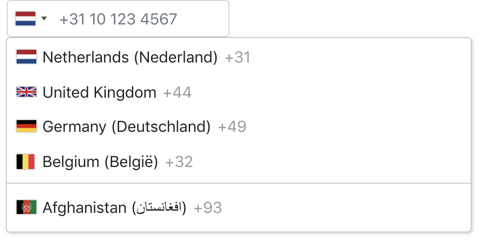

# International Telephone Input

This package is based on [https://github.com/webcat12345/ngx-intl-tel-input](https://github.com/webcat12345/ngx-intl-tel-input). But since it's no longer maintained I decided to update it to work with Angular 7. Also phone number validation is working now and there is support for the (Reactive)FormsModule.



## Installation

1. Install [ngx-bootstrap](https://valor-software.com/ngx-bootstrap/#/)
```bash
$ ng add ngx-bootstrap
```

2. Install [intl-tel-input](https://github.com/jackocnr/intl-tel-input)
```bash
$ npm install intl-tel-input --save
```

3. Add intl-tel-input css to angular.json
Look for the `styles` array in your angular.json and add `./node_modules/intl-tel-input/build/css/intlTelInput.css`. It should look like this after adding it:
```typescript
"styles": [
  ...
  "./node_modules/bootstrap/dist/css/bootstrap.min.css",
  "./node_modules/ngx-bootstrap/datepicker/bs-datepicker.css",
  "./node_modules/intl-tel-input/build/css/intlTelInput.css",
  "src/styles.css"
  ...
],
```
4. Install [google-libphonenumber](https://github.com/ruimarinho/google-libphonenumber)
```bash
$ npm install google-libphonenumber --save
```

5. Install this library
```bash
$ npm install angular-intl-tel-input --save
```

6. Add BsDropDownModule and IntlTelInputModule to your angular module file
```typescript
imports: [
    ...
    BsDropdownModule.forRoot(),
    IntlTelInputModule,
    ...
  ]
```

## Example usage
```html
<div class="container">
  <form #form="ngForm">
    <intl-tel-input [preferredCountries]="['nl', 'gb', 'de', 'be']" [enablePlaceholder]="true" name="phoneNumber" ngModel></intl-tel-input>
  </form>

  <pre>{{ form.value | json }}</pre>
</div>
```

### Live example (Flags are not working in the live example for some reason)
https://stackblitz.com/edit/angular-opecoe
